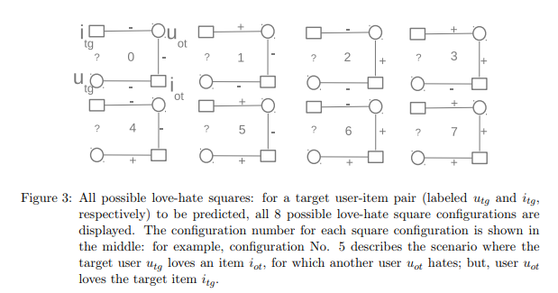
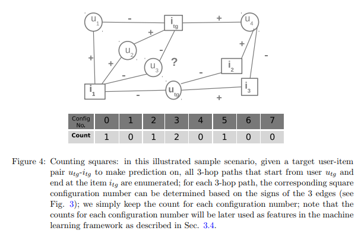

## Whatcha reading today, doc?!

Welcome to BookLook! BookLook is a recommender system for book readers which aims to assist users in the task of finding the next book to read. BookLook will take into account both the dislikes and likes of the reader and his/her friends to recommend the “Next book to read”. 


### Motivation

Let's take an example to explain this! Suppose Cav is friends with Trump and Parisa. Now, Cav hates 3 books which Trump also hates & Cav loves 3 books which Parisa also loves. Now if we know that Trump likes "Twilight" and Parisa likes "Life of Pie", then , is it more likely for Cav to like "Twilight" or "Life of Pie"? This is exactly the question we are trying to answer with BookLook!

### Related Work

There are existing book recommending systems in the market. Goodreads is one such example, it provides personalised recommendations based on user interests and collaborative models. These recommendations are based on books the user recently shelved, and from the overall ratings of books provided by all the users on the platform.

However, Goodreads does not seem to take into account the likes and dislikes of a user’s friends while recommending books to the user. BookLook does take this dislike/hate feature into account. [1] talks about how the most powerful signal in predicting a user’s high rating of an item comes from what items he or his friends dislike.

### Proposed solution

We plan to use the Book-crossing dataset [2]. For implementation we are referring to [1] and will implement the Love-Hate Square counting Method. This method basically uses user-content collaborative filtering using network-based techniques. 

In the Love-Hate Square counting method, we would first create a bipartite rating network with two types of nodes (i.e. the users represented by circular nodes and the books represented by square nodes); the edges carrying scores which represent the users’ ratings to items; or all edges can be categorized as an I-love-it or an I-hate-it edge based on whether the rating score for the edge is above or below a threshold.



For a target user-item (u − i) pair, all squares involving the given user-item pair (i.e. paths that start from user u and end at the item i) are identified; the counts for each particular love-hate square configuration are tabulated; the counts for each love-hate configuration are then used as features in a machine learning framework for training and prediction [1].



### Evaluation and analysis of results

We use various Machine learning classifiers for training and prediction: Naive Bayes, Logistic Regression,SVM, Decision Trees and K-Nearest Neighbours. For evaluation, we use RMSE, Recall, Precision,F-measure metrics. Following are the results.

```markdown
Machine Classifier     RMSE   Recall(Love)  Precision(Love)  Recall(Hate)  Precision(Hate) F-measure(Love) F-measure(Hate)
  Naive Bayes          0.664  0.276          0.419            0.744         0.606           0.333           0.668  
  SVM                  0.631  0.083          0.558            0.955         0.607           0.145           0.742
  Logistic Regression  0.628  0.093          0.570            0.952         0.609           0.160           0.743
  Decision Tree        0.633  0.159          0.512            0.897         0.613           0.242           0.728
  KNN                  0.665  0.384          0.460            0.696         0.626           0.419           0.660
```
We see that the RMSE values is on an average a 0.6 across all classifiers. The recall value of 'Love' though shows that the algorithm is achieving this good RMSE by classfying everything as 'hate'.It is important to notice that the threshold value to divide ratings into 'Love' and 'hate' was kept to be 6. 

### Conclusions
In this work, we tried to show that hate is as powerful a signal as is love towards a particular commodity and helps in indicating an user's preferences. 

### References
[1](http://proceedings.mlr.press/v18/kong12a/kong12a.pdf) Love-Hate Square Counting Method for Recommender Systems.

[2](http://www2.informatik.uni-freiburg.de/~cziegler/BX/) Book-Crossing Dataset.
